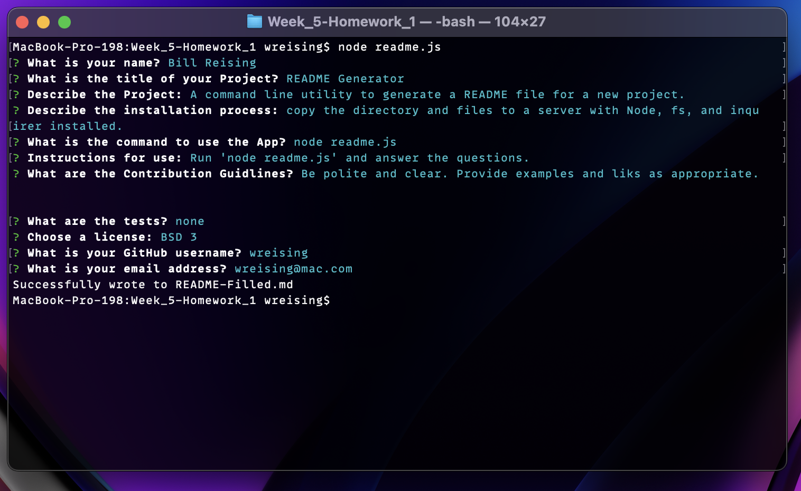

# README - README Generator 

### By: [Bill Reising](#questions)

---

## App Description

A command line utility to generate a README file for a new project.

**[Link to Screencast of utility in action](https://drive.google.com/file/d/1R4LeteEnSQppnwmtE_sDOX09Xy2hz_P-/view)**

**[Sample README file generated by utility](README-Filled.md)**

---

## Table of Contents
- [Instalation Instructions](#installation-instructions)
- [Command to Use](#command)
- [Instructions](#instructions)
- [Contribution Guidlines](#contribution)
- [Tests](#tests)
- [License](#license)
- [Questions](#questions)

---

## Installation Instructions {#install}

copy the directory and files to a server with Node, fs, and inquirer installed.

## Command to use: {#command}

<code>node readme.js</code>

## Instructions: {#instructions}

Run 'node readme.js' and answer the questions.

## Contribution Guidlines {#contribution}

Be polite and clear. Provide examples and liks as appropriate.

## Tests {#tests}

none

## License: BSD 3 {#license}

>The BSD 3-clause license allows you almost unlimited freedom with the software so long as you include the BSD copyright and license notice in it (found in Fulltext). You may not use the names of the original company or its members to endorse derived products.

---

## Questions: {#questions}

Find the source for this project and more on **[GitHub](https://github.com/wreising).**

**[email](wreising@mac.com)** me with any further questions.

---

README generated by [README Generator](https://github.com/wreising/Week_5-Homework_1)

© 2022 William Reising
